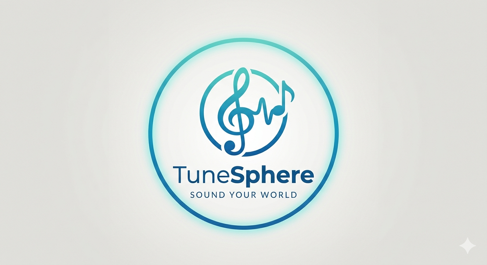

# 🎵 TuneSphere — Твой плеер

> Простой, но мощный музыкальный стриминговый сервис с загрузкой треков, плейлистами, рекомендациями и социальными функциями.



## ✨ О проекте

**TuneSphere** — это pet-проект, вдохновлённый **SoundCloud**. Здесь пользователи могут загружать свои треки, создавать плейлисты, следить за артистами, лайкать и комментировать музыку.


## 🚀 Основные возможности

### Для пользователей
- **Регистрация и авторизация** (JWT + Refresh Token)
- **Загрузка собственных треков** (с обложкой и метаданными)
- **Прослушивание музыки** + история прослушиваний
- **Создание и редактирование плейлистов** (публичные/приватные)
- **Лайки и избранное**
- **Подписки на артистов**
- **Комментарии** к трекам
- **Простые персональные рекомендации** (через Kafka)

### Для артистов и администраторов
- Специальная роль **ARTIST**
- Удобное управление своими треками
- Статистика прослушиваний
- Роль **ADMIN** для модерации

### Технические возможности
- Полноценный **Event-Driven** подход через **Kafka**
- Мониторинг в реальном времени (**Prometheus + Grafana**)
- Устойчивость (**Resilience4j** — Circuit Breaker, Retry)
- API Gateway (в планах)
- Полная контейнеризация через Docker Compose

## 🛠 Технологический стек

**Backend:**
- Java 21 + Spring Boot 4.0.5
- Spring Security + JWT
- Spring Data JPA + Flyway
- PostgreSQL
- Apache Kafka
- Resilience4j
- MapStruct, Lombok, Validation

**Observability:**
- Actuator + Micrometer
- Prometheus + Grafana

**DevOps:**
- Docker + Docker Compose
- Testcontainers + Embedded Kafka

**Frontend (в разработке):**
- React + Vite + Axios (планируется)

## 🏃 Как запустить проект

### 1. Через Docker Compose (рекомендуется)

```bash
docker compose up -d --build
```

Сервисы будут доступны по адресам:
- **Приложение**: http://localhost:8080
- **Swagger**: http://localhost:8080/swagger-ui.html
- **Kafka UI**: http://localhost:8081
- **Prometheus**: http://localhost:9090
- **Grafana**: http://localhost:3000 (admin/admin)

### 2. Локально

```bash
# Запуск БД и Kafka
docker compose up postgres kafka -d

# Запуск приложения
./mvnw spring-boot:run -Dspring.profiles.active=dev
```

## 📁 Структура проекта

```
tunesphere/
├── src/main/java/com/tunesphere/
│   ├── controller/      # REST-контроллеры
│   ├── service/         # Бизнес-логика
│   ├── repository/      # Репозитории
│   ├── entity/          # JPA-сущности
│   ├── dto/             # Data Transfer Objects
│   ├── event/           # Kafka события
│   ├── security/        # JWT + Security
│   └── config/          # Конфигурации
├── src/main/resources/
│   ├── db/migration/    # Flyway-миграции
│   └── application*.yml
├── docker-compose.yml
└── prometheus/
```

## 🎯 Планы развития

- [ ] Полноценный React/Vite фронтенд
- [ ] Загрузка файлов через MinIO / S3
- [ ] Реальное время (WebSocket + комментарии)
- [ ] Продвинутые рекомендации
- [ ] API Gateway + микросервисы
- [ ] CI/CD (GitHub Actions)

---

**Автор:** MrDobryak88  
**Статус:** В активной разработке

---
